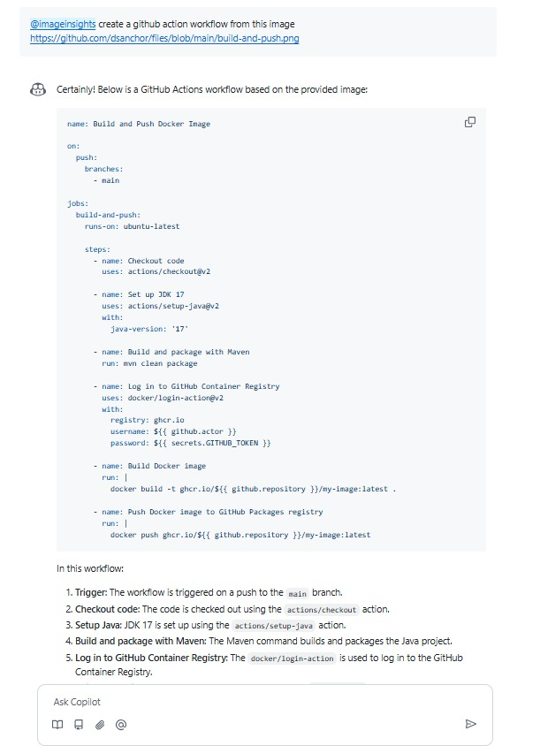

# Image insights GitHub Copilot extension

[Original repository](https://github.com/ambilykk/img-insight-extension)

## Run locally

1. Clone the repository
2. Run `npm install`
3. Create an .env file  under *img-insight-extn* with the following content:
```
GITHUB_KEYS_URI=https://api.github.com/meta/public_keys/copilot_api
AZURE_OPENAI_ENDPOINT=<YOUR_AZURE_OPENAI_ENDPOINT>
AZURE_OPENAI_API_KEY=<YOUR_AZURE_OPENAI_API_KEY>
OPENAI_API_VERSION=<API_VERSION> Ex: 2023-03-15-preview
```
4. Run `npm start`
5. Open a new terminal and run `ngrok http http://localhost:3000`	
6. Set up a new GitHub app following the instructions [here](https://docs.github.com/en/copilot/building-copilot-extensions/creating-a-copilot-extension/creating-a-github-app-for-your-copilot-extension)

## Usage

Open a new chat session at github.com and type `@your-extension-name` followed by a text message (just to launch GitHub app connection to you account). 

After that, refresh the page and you should see the extension icon in the chat. Take the url of the image you want to analyze and paste it in the chat. Ex:

```
@imgageinsights create a github actions workflow from https://github.com/dsanchor/img-insight-extension/blob/main/demos/build-and-push.png
```

